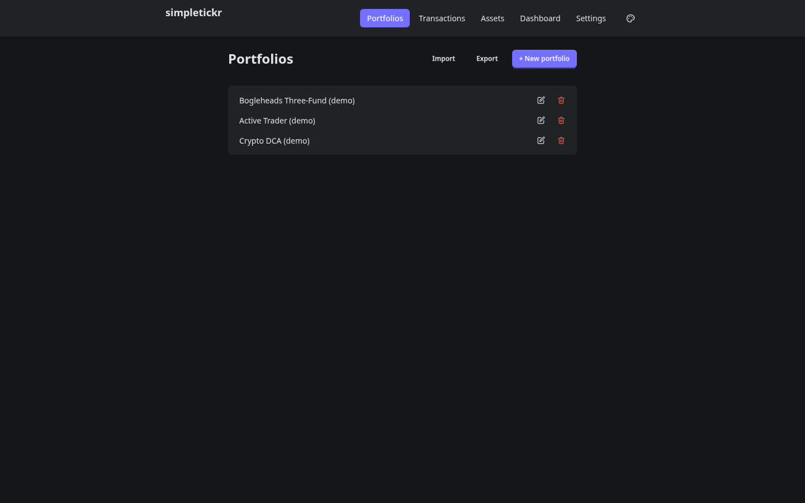
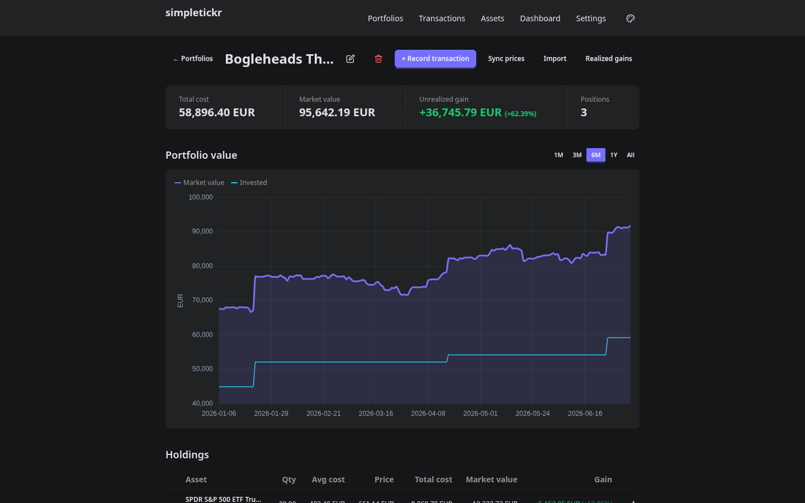
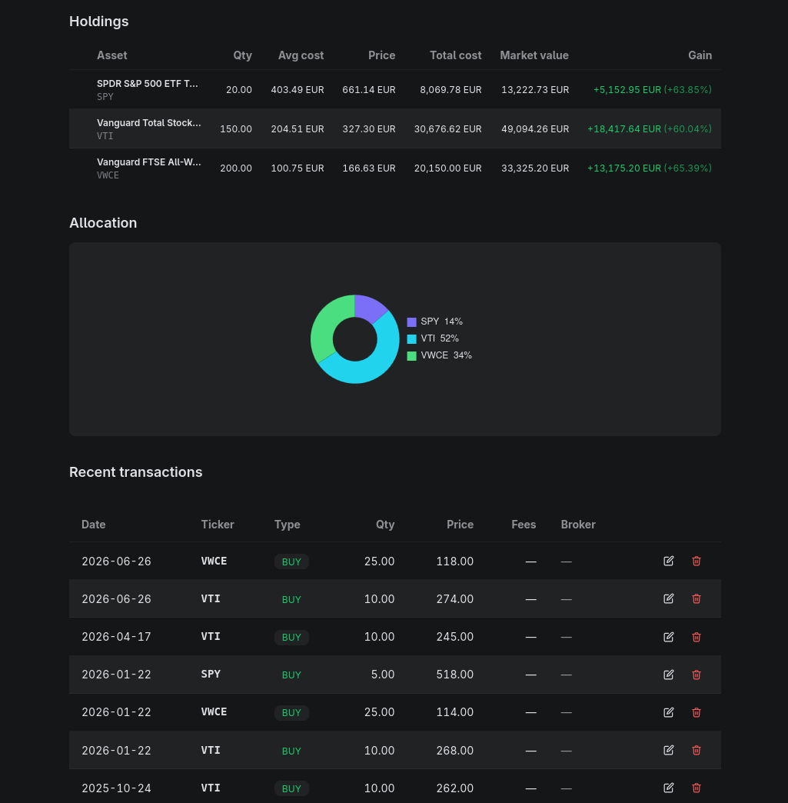
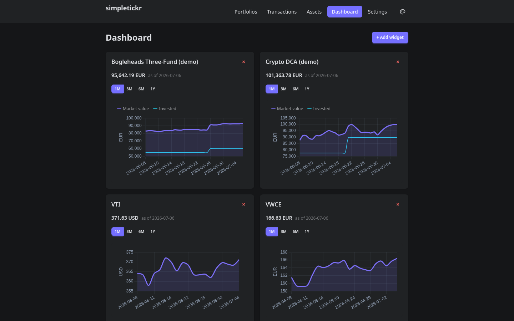
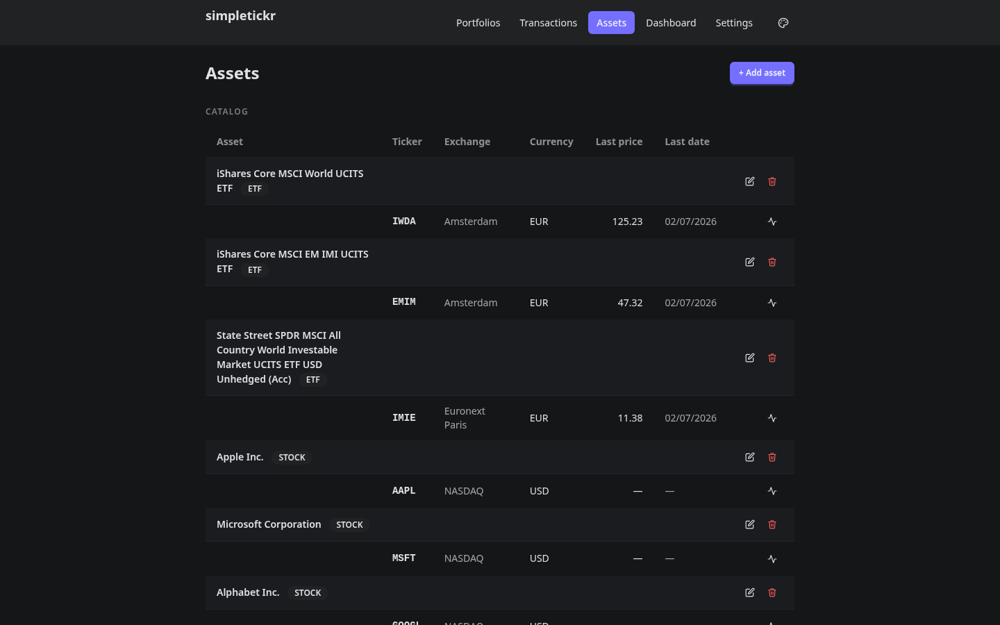

# simpletickr

A simple portfolio tracker for ETFs, stocks, crypto, and other assets — built around the [Bogleheads](https://www.bogleheads.org) philosophy of long-term, passive investing.

simpletickr is intentionally **not** a trading tool. There are no intra-day charts, no real-time tickers, no alerts. The focus is on the long view: track what you own, at what cost, and how it's grown over time.

simpletickr doesn't track you or phone home. It's self-hosted, and your portfolio data stays in your own database — it's never collected, transmitted to, or seen by us.

## Table of Contents

<!-- TOC -->
* [simpletickr](#simpletickr)
  * [Table of Contents](#table-of-contents)
  * [Features](#features)
  * [Screenshots](#screenshots)
  * [Self-hosting](#self-hosting)
    * [Prerequisites](#prerequisites)
    * [Quick start](#quick-start)
    * [Environment variables](#environment-variables)
    * [Accessing from another machine](#accessing-from-another-machine)
    * [Kubernetes (Helm)](#kubernetes-helm)
  * [Development](#development)
  * [AI pair programming](#ai-pair-programming)
<!-- TOC -->>

## Features

- Multiple portfolios with per-portfolio base currency
- Assets with exchange listings and price provider mappings
- Transaction history (buy, sell, dividend, fee)
- Holdings view with live valuations and FX conversion
- Realized gains report (FIFO or AVCO)
- Automatic price sync via Yahoo Finance
- Configurable dashboard widgets
- JSON export and import

## Screenshots

Create and manage multiple portfolios :



Main portfolio page, with the value graph, holdings summary, allocation graph and recent transactions :





Dashboard :



List of assets :



## Self-hosting

### Prerequisites

- Docker and Docker Compose

### Quick start

```bash
# 1. Clone and enter the repo
git clone https://github.com/simpleappslabs/simpletickr.git
cd simpletickr

# 2. Create your env file
cp .env.example .env

# 3. Start everything
docker compose up -d
```

The app is available at **http://localhost:8088**. An nginx reverse proxy (`nginx.conf`) serves the frontend at `/` and the API at `/api` on that same origin — the frontend and backend containers aren't published to the host directly.

Data is stored in a named Docker volume (`db_data`) and persists across restarts.

### Environment variables

| Variable              | Required | Default | Description                                                                                                          |
|-----------------------|----------|---------|------------------------------------------------------------------------------------------------------------------------|
| `DB_NAME`             | yes      | —       | PostgreSQL database name                                                                                             |
| `DB_USER`             | yes      | —       | PostgreSQL username                                                                                                  |
| `DB_PASSWORD`         | yes      | —       | PostgreSQL password                                                                                                  |
| `PUBLIC_API_BASE_URL` | no       | `/api`  | URL the browser uses to reach the API. Relative by default (same-origin, via the reverse proxy) — only override this if pointing the frontend at a different backend. |

### Accessing from another machine

Since the frontend always calls its own origin's `/api`, this works out of the box — just visit `http://<server-ip>:8088` from the other device. No configuration needed.

### Kubernetes (Helm)

The Helm chart lives in `charts/simpletickr`. It depends on the Bitnami PostgreSQL subchart, so add the repo first:

```bash
helm repo add bitnami https://charts.bitnami.com/bitnami
helm dependency update charts/simpletickr
```

**With the bundled PostgreSQL** — simplest path, good for a dev cluster:

```bash
helm install simpletickr charts/simpletickr \
  --set postgresql.enabled=true \
  --set postgresql.auth.password=changeme \
  --set ingress.enabled=true \
  --set ingress.hosts[0]=simpletickr.example.com
```

**With an external database** — recommended for production:

```bash
helm install simpletickr charts/simpletickr \
  --set backend.db.host=your-db-host \
  --set backend.db.password=changeme \
  --set ingress.enabled=true \
  --set ingress.hosts[0]=simpletickr.example.com
```

Frontend and backend are served from the same Ingress: the frontend at `/`
and the API under `/api` — same-origin, no CORS needed between them. Add
more `--set ingress.hosts[1]=...` entries to expose the
same app under multiple domains (e.g. a LAN hostname and a Tailscale
hostname pointing at the same instances). The backend always answers under
`/api` (via its Spring servlet context-path), whether or not the chart's own
Ingress is enabled. `backend.corsAllowedOrigins` is still available for
cross-origin API access from something other than this chart's frontend.

To use a pre-existing Secret for the database password, set `backend.db.existingSecret.name` and `backend.db.existingSecret.key` instead of `backend.db.password`. See `charts/simpletickr/values.yaml` for the full reference.

## Development

See [CONTRIBUTING.md](CONTRIBUTING.md) for local setup, architecture overview, and development workflow.

## AI pair programming

This project is built with AI pair programming — see [AI.md](AI.md) for details.
